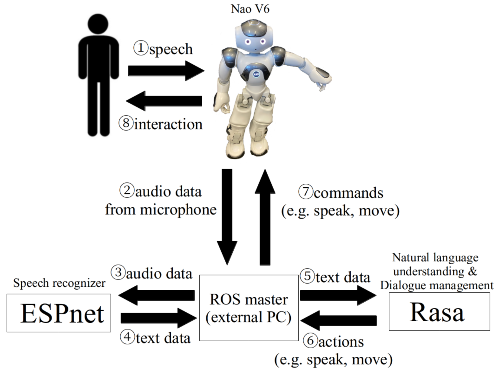

# OpenSource4NaturalHRInteraction

## About
Open Source System Integration Towards Natural Interaction with Robots



This repository contains an open source robot interaction architecture to enable natural interacton with a reobot agent. The system is built on a ROS platform and it integrates ESPnet speech recognizer (Watanabe et al. 2018 https://arxiv.org/abs/1804.00015), Rasa dialogue model (https://rasa.com/) and Nao Robot (https://www.softbankrobotics.com/emea/en/nao)

## Setup environment
These programs are run on 
* Ubuntu 18.04
* Quadro RTX 5000 Mobile / Max-Q
* ROS melodic
* Cuda 10.1
* CUDNN 7.6.5

1. Install ROS melodic
* Please refer to install guide like [here](http://wiki.ros.org/melodic/Installation/Ubuntu).

2. Install necessary modules
```
sudo apt-get update
sudo apt-get upgrade
sudo apt-get install python-catkin-tools python-gobject python-pip python3-pip ros-melodic-jsk-tools ros-melodic-jsk-common
pip install --upgrade pip
pip3 install --upgrade pip
```

3. Install Rasa
```
pip3 install testresources==2.0.1
pip3 install nltk==3.6.2
pip3 install regex==2020.9.27
pip3 install rasa==2.7.1
pip3 install rasa[transformers]==2.7.1
pip3 install spacy==2.3.5
python3 -m spacy download en_core_web_md
python3 -m spacy link en_core_web_md en
(For Japanese) pip3 install ginza==4.0.5
(For Japanese) python3 -m spacy download ja_core_news_sm
(For Japanese) python3 -m spacy download ja_core_news_md
(For Japanese) python3 -m spacy download ja_core_news_lg
```

4. Install ESPnet
```
sudo apt-get install cmake sox libsndfile1-dev ffmpeg flac
pip3 install soundfile==0.10.3.post1
pip3 install espnet==0.10.1
pip3 install espnet-model-zoo==0.1.5
pip3 install kenlm==0.0.0
```

For more information, please refer to [here](https://espnet.github.io/espnet/installation.html).


5. Install ``Python NAOqi SDK``
* You can download it from [here](https://www.softbankrobotics.com/emea/en/support/nao-6/downloads-softwares/former-versions?os=49&category=39). 
Please change the tab to SDKs. Version < 2.5.5 may cause error.
  * Please unzip the downloaded file.
  * Please create pynaoqi folder in your home directory.
  * Then put the file under your pynaoqi folder.

6. Write environment variables in your ``.bashrc``
```
export PYTHONPATH=$HOME/pynaoqi/pynaoqi-python2.7-2.8.6.23-linux64-20191127_152327/lib/python2.7/site-packages:$PYTHONPATH
export NAO_IP="169.254.XX.YYY"
rossetip
```

## Installation

Follow the below commands.
```
source ~/.bashrc
mkdir -p ~/catkin_ws/src
cd ~/catkin_ws/src
git clone -b hri-review https://github.com/ayfujii-aist/OpenSource4NaturalHRInteraction
bash OpenSource4NaturalHRInteraction/setup.bash
cd .. # catkin_ws
catkin build
echo "source ~/catkin_ws/devel/setup.bash" >> ~/.bashrc
source ~/.bashrc
```

## How to use

If you want to use with Nao v6
* Check your "network_interface" by ```ifconfig```
* Start by saying "Hello" (or some simple greeting) to the robot.
```
roscore
roslaunch nao_v6 nao_v6.launch network_interface:=wlan0
roslaunch esp_rasa_nao esp_rasa_nao.launch
```

You can also test without Nao.
In this case, you may need to change the roslaunch parameters.
```
roslaunch esp_rasa_pc sample_with_pc.launch
```

Following is an example of conversation.
```
You "Good morning."
Robot "Hi!"
You "Please search a restaurant."
Robot "How about sushi?"
You "OK"
Robot "Great! Here's what I found
```
* Dialogue example in languages/en-US repository is based on the example provided by Rasa. (https://github.com/RasaHQ/rasa/tree/main/examples/e2ebot)

#### Change the roslaunch parameters
* Check your pc microphone channels, depth, and sample rate by using ```pactl list short sinks```
  * Please change "n_channel", "depth" and "sample_rate" 

* Check your card and device number of microphone by using ```arecord -l```
  * Please change "device" as "hw:[card number],[device number]"

* Change "volume_threshold" for volume detection according to your environment.

#### Change the interaction contents
Please change yaml files in ```rasa_ros/languages/en-US```

For more information, please refer to [here](https://rasa.com/docs/rasa/2.x/training-data-format).

#### Change the language
Please change the roslaunch parameters of "language" and "data_language"

Please add your language folder in rasa_ros/languages (like "en-US") and add your xml files in the language folder.

Please add the espnet dataset name in your language like [here](https://github.com/aistairc/OpenSource4NaturalHRInteraction/esp_rasa_nao/scripts/make_wav4espnet.py#L28).

Please download spaCy model and write it in config.yml like ```language: en```.

#### Add robot gestures
Please write your original gestures in ```rasa_ros/actions/actions.py```.


#### Not training rasa every roslaunch
* Set "train_nlu" and "train_story" false.

````
roslaunch esp_rasa_nao esp_rasa_nao.launch train_nlu:=false train_story:=false
````

## Authors
The work is done by Ayaka Fujii as Research Assistant at AIST AI Research Center, under the supervision of Kristiina Jokinen.